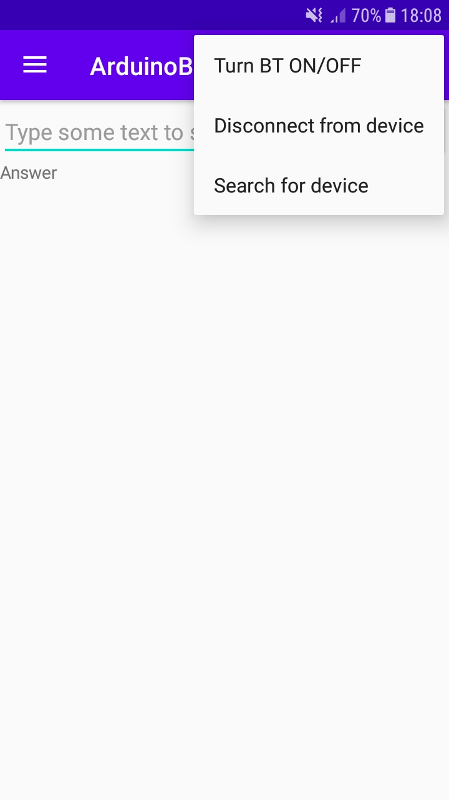
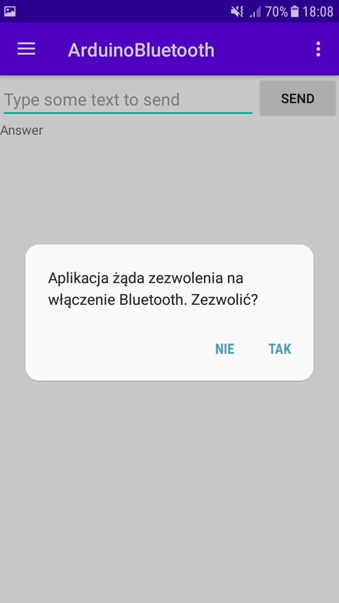
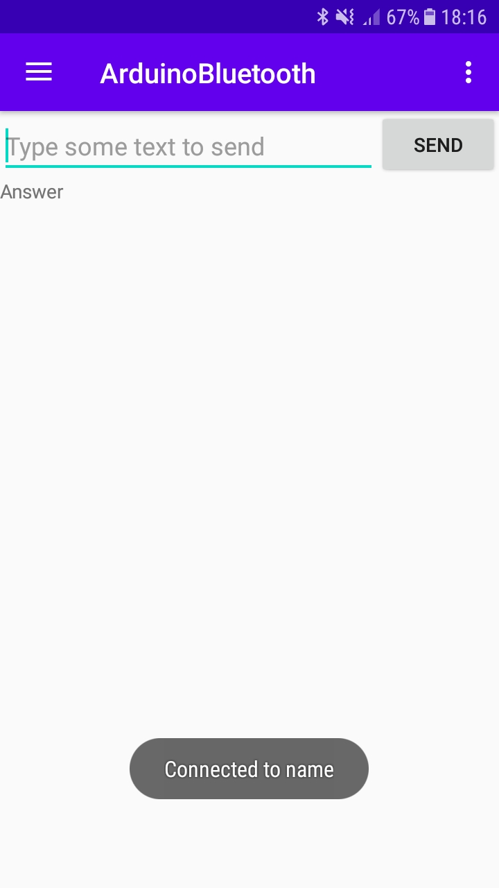

# Android - Arduino controlling via Bluetooth connection

## Table of contents
* [About project](#about-project)
* [Technologies](#technologies)
* [Features](#features)
* [Essential modules](#essential-modules)
* [Example screenshots](#example-screenshots)
* [Preview video](#preview-video)

## About project
Application allows communication via Bluetooth between Android devices and Arduino board.
In this project I've used Arduino Mega2560 with HC-06 bluetooth module and RGB matrices MAX7219.
Arduino's program schema is inside *arduino_app* folder. After successful installation of both programs
the user is able to connect to Arduino's HC-06 module and send data to the arduino's serial port, 
the data will be displayed as a scrolling text on RGB matrices.

## Technologies
* Java
* C++

## Features
* turn BT on/off
* get list of paired devices
* search for new device to pair with
* BT connection is kept between fragments
* first fragment allows to send any type of string to serial port of arduino to be displayed on RBG matrices
* second fragment is a basic calculator, clicking any button sends data to arduino that displays equations that user does using this calculator

## Essential modules
* [Arduino Mega2560](https://store.arduino.cc/arduino-mega-2560-rev3)
* [HC-06](https://www.amazon.com/HiLetgo-Wireless-Bluetooth-Transceiver-Bi-Directional/dp/B07VL6ZH67/ref=sr_1_3?dchild=1&keywords=hc-06&qid=1619189849&sr=8-3)
* [MAX7219](https://www.amazon.com/DAOKI-MAX7219-Control-Display-Raspberry/dp/B07X95H9DT/ref=sr_1_6?dchild=1&keywords=MAX7219&qid=1619189950&sr=8-6)

[connection]: ./readme_images/connection_schema.png "connection"

## Connection schema
![connection schema][connection]

## Example screenshots
#### Drop down options

#### After turning BT on, app will ask for permission

#### Successful connection to device - "connected to name" ('name' = my HC-06's name) 

## Preview video

https://user-images.githubusercontent.com/63047043/115904462-17083c80-a465-11eb-9a67-393222194e14.mp4

